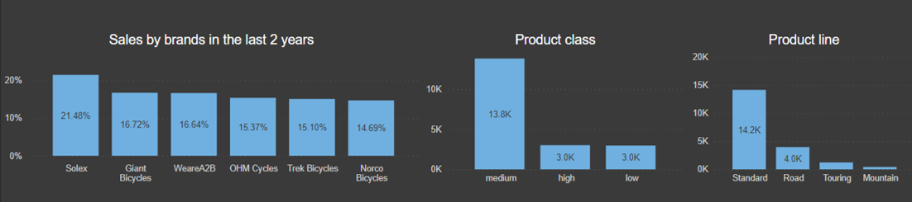
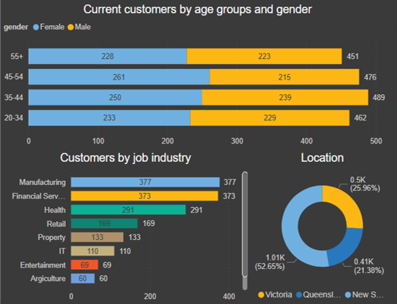
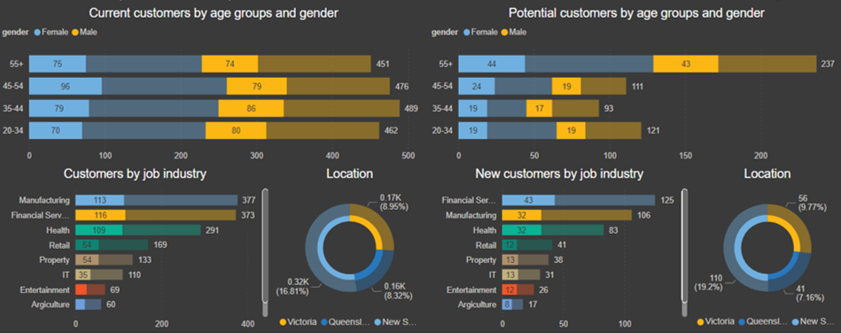
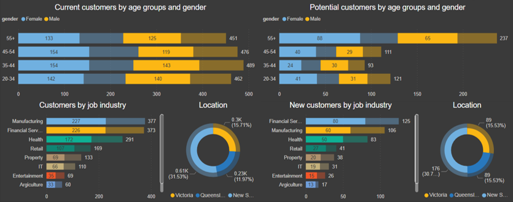
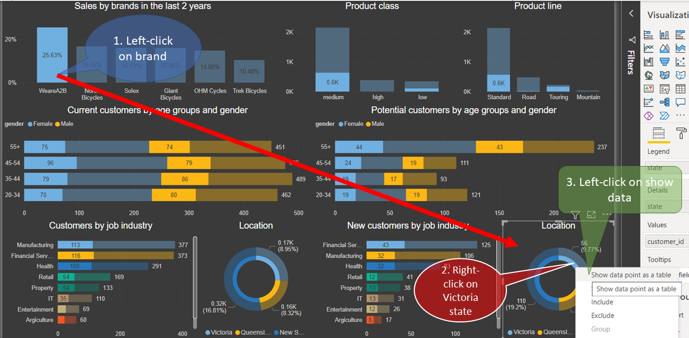
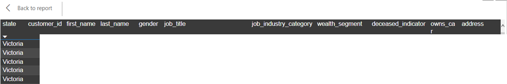

### Bike e-Shop Customer Trends Analytic Report 

### Case brief

> A successful Bike e-Shop using the targeting marketing strategy wants a more intelligent way to the insight of the current customers which will improve the performance of the marketing team that target high-value customers from lists of potential customers.

##### Focus
- Analyse the existing customer trends and behaviour using the collected 3 datasets: Customer demographic, customer address and transactions.

### Data Exploration
##### Sales

Analysing the Company X existing sales and customer behaviour for the last 2 years using the existing 3 datasets: customer demographic, customer address and transactions revealed that from 2883 units total sold, 75% was a medium-class product and 74% in the standard product line.

_Across brands, the most popular was WeareA2B 25.63% and the group Norco, Solex, Giant accounted for 49% of the sales._

##### Current Customers

The market segmentation of current customer behaviours has identified no significant indicators depending on gender or age groups. 

_By location, 52.65% of customers are from New South Wales, 25.96% from Victoria and 21.38% - Queensland._

_Manufacturing and Financial services industries are leading with 13% each and  Health industry with 10% of customers._

### Model Development
##### Top brand

The cross-analysis of the top brand WeareA2B that drive 25.63% of sales has revealed a significant potential on the 55+ age group of new customers - 8.7% located in New South Wales - 19.2%, Victoria - 9.77% and Queensland 7.16%.

_By job industry keeping the same pattern Manufacturing, Financial Services and Health industries._

##### Top brand 2

The cross-analysis of the group Norco, Solex, Giant that drives 49% of sales has revealed a significant potential on the 55+ age group of new customers – 15.3% located in New South Wales – 30.7%, Victoria and Queensland – 15.53%.

_By job industry-leading Financial Services and for Manufacturing and Health industries keeping the same pattern._

### Interpretation and advice 

According to the results, the acquisition of the most valuable customers for Company X from the new list of 1000 potential customers is recommended in 2 main stages:

> Marketing campaign based on top seller WeareA2B and their medium-class product and standard line or upgrade to a newer product. 

_Targeting customers from all age groups in New South Wales, Victoria and Queensland have a **potential of 20.4% in the short term vision.**_

> Seasonal offers based on the group Norco, Solex, Giant engaged within a loyalty program such as 2 years breakdown cover.

_Targeting customers from all age groups in New South Wales, Victoria and Queensland have a **potential of 34.8% in the long term vision.**_

##### The practical use of the Interactive Dashboard

- The tool is offering a 3-click way to filter and access the list of targeted customers. 

The example below filters new customers by brand located in the Victoria state and the report is displaying only these clients.

