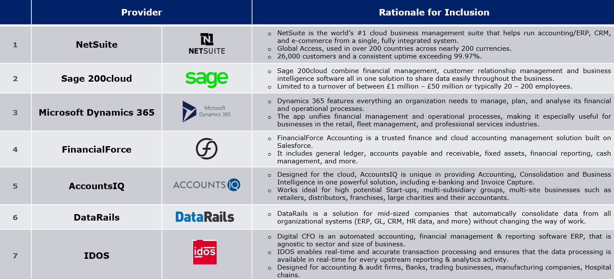
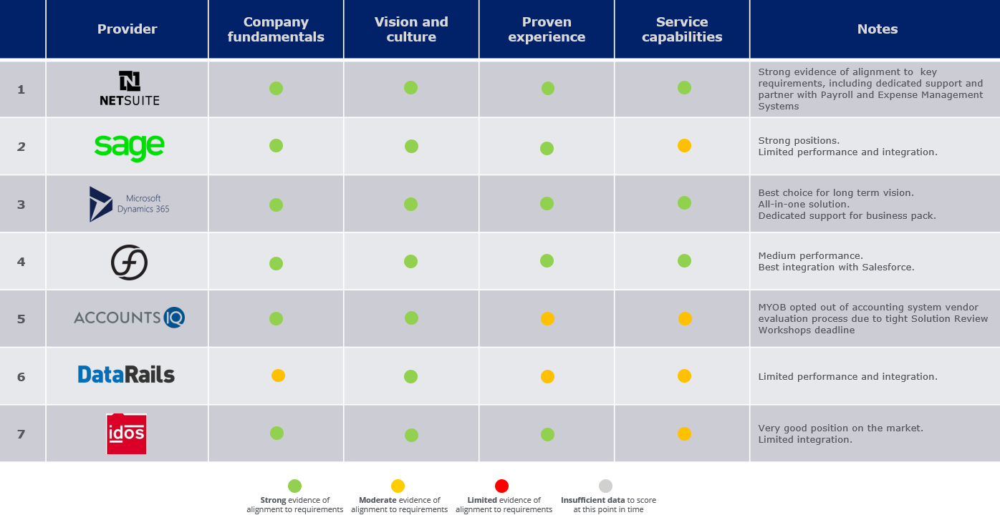
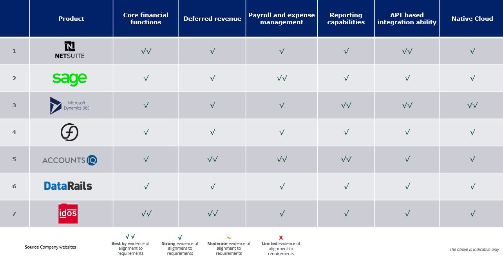
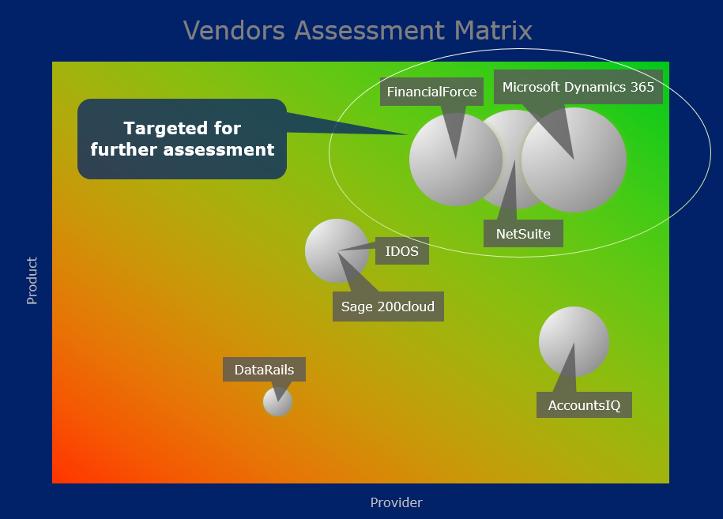
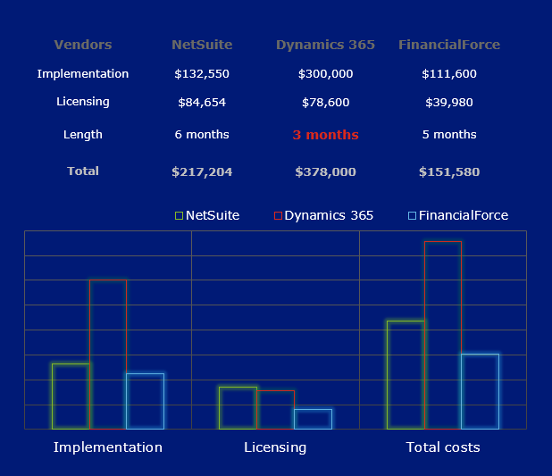
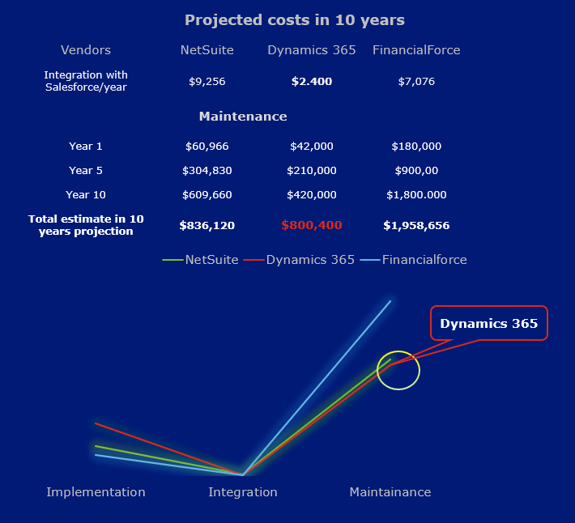
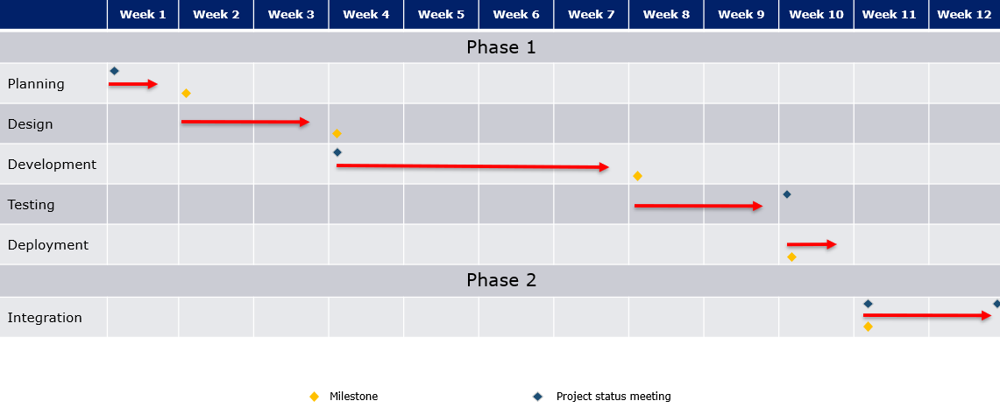

# Market Scan Analytic Report 
##### _(Presentation short story)_

### Case brief
>Company X asked for consultancy in their market scan to establish and selection for a new financial accounting management solution. 
It plans to open a manufacturing site and expand its network and for a long term vision, the aim is to ensure an efficient, smooth, high-quality approach to its resources.

### Technology Evaluation

***Initial market scan result***

- The initial market scan result was performed by available providers matching their product, the scope of work proposed and rationale for inclusion.

***Capability assessment framework***

- The capability assessment framework was developed based on the results of the workshops with key stakeholders. The analysis matrix was divided by reputation evaluation of providers and product characteristics by rating.

- [ ] Reputation evaluation of providers by:
  - Company fundamentals
  - Vision and culture
  - Proven experience
  - Service capabilities

- [ ] Product characteristics by:
  - Core financial functions 
  - Deferred revenue 
  - Payroll and expense management 
  - Reporting capabilities 
  - API based integration ability 
  - Cloud-native architecture

### Technology Analysis and Selection

For further assessment were selected the products:

<table>
<tbody>
  <tr>
    <td>

> NetSuite (Oracle);</td>
    <td rowspan="3">

- Strong evidence of alignment to key requirements, including dedicated Australian support. 

- Strong players in the financial solution market with a long term vision.
  
- All-in-one solution.
  
- Dedicated support for business pack.
  
  </td>
  </tr>
  <tr>
    <td>
    
> Dynamics 365 (Microsoft);</td>
  </tr>
  <tr>
    <td>
    
> FinancialForce (Salesforce). </td>
  </tr>
</tbody>
</table>

#### Evaluation 

> _Phase 1 (Implementation)_

The result shows that FinancialForce is the most cost-saving choice. The implementation timeline is for 5 months while Dynamics 365 offer a faster implementation but at a higher price.

> _Phase 2 (Integration and projected costs for maintenance)_

The overall integration time with Salesforce is 2 weeks for all solutions. 
The Dynamics 365 is the most cost-efficient choice and offer more options.
The total costs of Implementation, Integration and Maintenance projected for 10 years shows that Dynamics 365 is the best choice.

> _Analysis_

   - As the cost was estimated for 100 users and a full license of product these are adaptable to the organisation needs at the moment.
  
   - The Dynamics 365 offer great flexibility and the initial pack might start from 20 users on a basic license and extend at any time. 
  
   - Their product has risen in popularity in the last 2 years and it is forecasted as a major player on integrated enterprise cloud solutions.

#### Implementation and Integration Plan for Microsoft Dynamics 365

