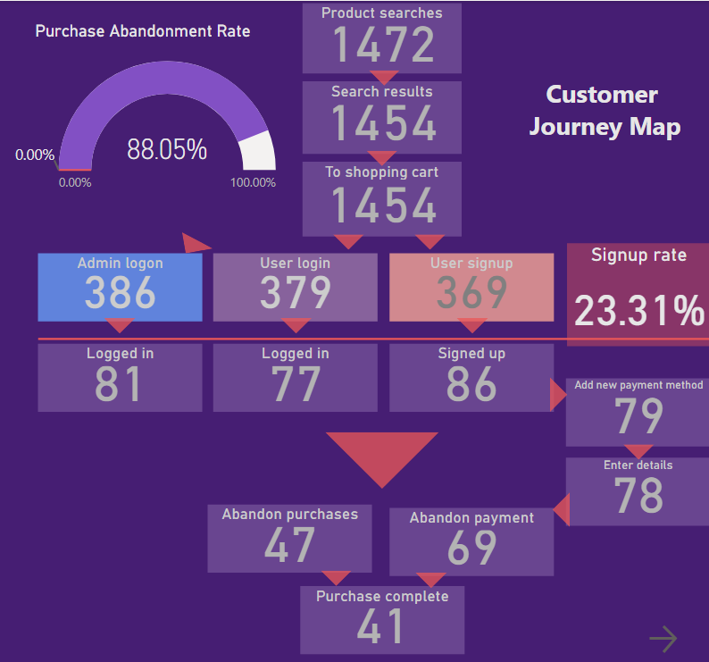

# Product engineering issues report 

### Case brief
>A client has launched a B2C e-commerce web app that operates over 3 months. The marketing effort brings more than 5k visitors monthly without essential sales. The product is managed by an outsourced support team that is focused on customer service and lack technical knowledge. The initial setup of Google Analytics does not reveal the significant issue and the client inquire for a deeper analysis of the usage data and potential issues.

### Focus

- Identify areas of vulnerability of the product or engineering issues and recommendations on how to avoid and mitigate these areas of risk.

### Analytics

_The performed analysis of the usage data has revealed the overall good health of the product. However, the Uptime score at 99.23% is slightly over the minimum standard across industry expected at 99.00 and the high purchase abandonment rate at 88.05% points out the engineering-related issues._

- To identify the issues with the high purchase abandonment rate a Customer Journey Map was modelled and populated with data.

_The modelling shows an essential issue related to the Authentication module that ​handles authentication schemes and makes the entire process seamless. ​Low signup rate and similarly login is directly linked with the high purchase abandonment rate._

_The main factors were identified as refresh, dormant and bounce referring to slow-loading._

>Common issues related to the authentification module are security vulnerabilities. 

- The cross-analysis Hack Attempt vs Website Uptime found the product vulnerable to one of the main web security threats Cross-site scripting (XSS). 

The monthly analysis of XSS attacks shows a direct link with the downtime.

_It compromises the interactions that users have on the website affecting the downtime._

- The cross-analysis LiveChat functional vs Website Uptime shows how the LiveChat functions Delete, Read and Sent are affecting the Website Uptime. These are continuously over the months. 

_The Message Delete function has scored the Uptime at 98.85 in May which is much under the minimum standard expected at 99.00._

### Results and advise

Modelling a customer routine cross analysed with the usage data has indicated the following main product issues:
- Authentication module failing;
- Cross-site scripting vulnerabilities;
- LiveChat functions Delete, Read and Sent.

The recommendations to alleviate these risks are:
- reviewing code and developing a viable Authentication module and consolidating the integration of LiveChat functional;
- analyse the JavaScript code and apply cybersecurity solutions to prevent attacks;
- develop an efficient content security policy and provide a dedicated course to train and maintain awareness across employees.