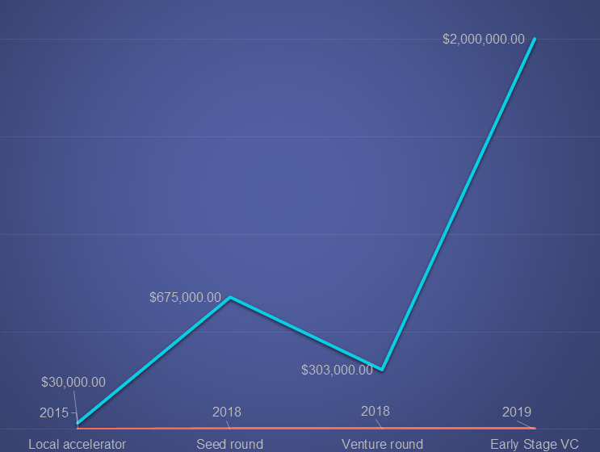
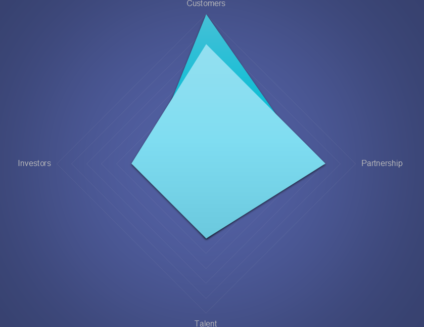
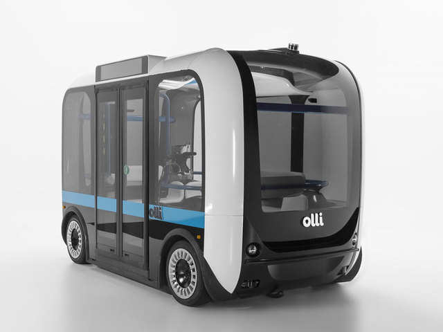
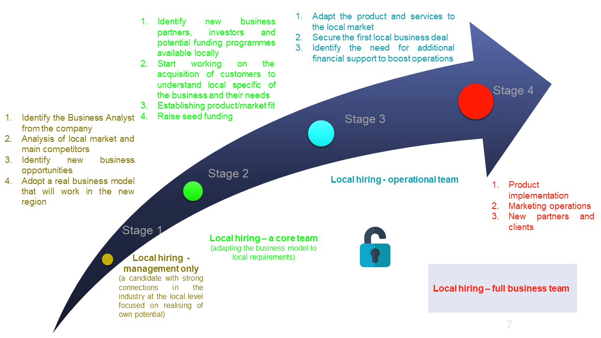

# US Expansion Opportunity 

### Goal
>Long term operation on the US market

### Company X
>_Location:_ Australia

>_Field:_ Data Processing, Hosting, and Related Services Industry

>_Services:_ B2B software for on-demand shared transport systems

#### Valuation and Funding

#### Competitive environment

### Reasons for expanding in the US

#### Existing partnership

- Government initiatives (The Landing Pads programme) and home organisations (American Australian Association) that have the expertise and offer support to businesses on their launch on the US market
- Existing Corporate Customers such as Volvo which operates a manufacturing plant in Charleston, San Francisco can be a good start for expansion on the US market

#### Location
>San Francisco is one of the best options to start

1. Australian American Chamber of Commerce  operating in the San Francisco Bay Area can offer fast-track support to the expansion in San Francisco
2. Office of Small Business of City and County of San Francisco can be a useful partner as it offers all-in-one support for businesses (Accelerator)
3. San Francisco Business Portal offers tools and can connect with other interested businesses in the area
4. Volvo operates a manufacturing plant in Charleston, San Francisco and might be interested in the solution analogical to those in Australia

#### Legal Structure

| | | ||
| --- | --- | ---- | --- |
| Limited Liability Company (LLC) is the suitable business structure for operation on US Market. | The LLC entity is only required to file an informational tax return. | Every LLC that is doing business or organized in California must pay an annual tax of $800. |LLCs also pay the LLC fee based on income. |
| It allows include as a members individuals, partnership, corporations and foreign entities. | Additional taxes are at the state level. | It is exempt from the annual tax for its first taxable year. | For $250,000 - $499,999 the fee is $900 and $500,000 - $999,999 is $2,500 annually and for other categories is higher.|

### Potential for future partnership

#### Local Motors
>_Location:_ USA

>_Field:_ Automobile Manufacturing

>_Services:_ Olli - autonomous, electric-powered bus actively deployed in California

#### Valuation and Funding

>_Local Motors is backed by Mirai Creation Fund, Airbus Ventures, Scout Ventures, VTF Capital and others. The company raised $15M in a new round on Oct 16, 2020. This brings Local Motors' total funding to $15.25M to date._

### Staged Expansion Plan

