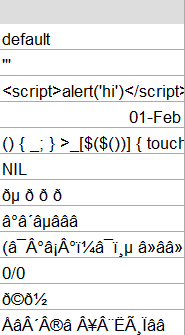

# Bike e-Shop new customer capture <a href="https://powerbi.microsoft.com/en-us/"></a>

### Case brief

> A successful Bike e-Shop using the targeting marketing strategy wants a more intelligent way to the insight of the current customers which will improve the performance of the marketing team that target high-value customers from lists of potential customers.

###### 1. Understanding the business

The client has few physical shops and uses Wix products for their website and transactions. The data is structured and stored in the Wix Code database in individual tables that can be downloaded as spreadsheets in .xlsx format.

###### 2. Understanding the data

The data is stored in separate collections Transaction, Demographics, and Customer Address by customers ID due to the access control over the sensitive information.
It was  analysed through a standard Data Quality Framework that found the following issues:
**Accuracy**
_Customer demographic sheet_
- A spare column with the name default has mixed data with code.



- The gender field is composed of different acronyms of Female and Male entries.


_Customer address sheet_
- The state field has combined entry of the states by acronym and full name.


**Validity**
_Transaction sheet_
- The list_price and standart_cost columns display different values such as integral numbers vs decimals.


_Customer demographic sheet_
- DOB column contains different date formats.


_These errors impacted the trueness of the results of analytics tools included in the Wix product package. The recommendations have been provided to the client to avoid the reoccurrence of data quality issues and improve the accuracy of input important for business decisions._

###### 3. Define the solution
The most suitable for the case is to use the Microsoft Power BI product:
- The data is ready for use after minimal transformations;
- The Marketing Team is familiar with the Microsoft products and additional training is not required;
- An Intelligent Dashboard is always ready to use and will offer detailed information on targeted new customers by their demographics and buying behaviour.

Agreed with the client the analysis will capture existing sales and customer behaviour for the last 2 years modelling the new potential customer list.

###### 4. Data Preparation 
Connect the data source


***Power Query Editor***
_CustomerAddress table_
a.	Promote the headers
```SQL
= Table.PromoteHeaders(CustomerAddress_Sheet, [PromoteAllScalars=true])
```
b.	Transform the data types
```SQL
= Table.TransformColumnTypes(#"Promoted Headers",{{"customer_id", Int64.Type}, {"address", type text}, {"postcode", Int64.Type}, {"state", type text}, {"country", type text}, {"property_valuation", Int64.Type}})
```
_CustomerDemographic table_
a.	Promote the headers
```SQL
= Table.PromoteHeaders(CustomerDemographic_Sheet, [PromoteAllScalars=true])
```
b.	Transform the data types
```SQL
= Table.TransformColumnTypes(#"Promoted Headers",{{"customer_id", Int64.Type}, {"first_name", type text}, {"last_name", type text}, {"gender", type text}, {"past_3_years_bike_related_purchases", Int64.Type}, {"DOB", type date}, {"job_title", type text}, {"job_industry_category", type text}, {"wealth_segment", type text}, {"deceased_indicator", type text}, {"owns_car", type text}, {"tenure", Int64.Type}})
```
c. Transform the data value in gender column
- from F into Female in gender column
```SQL
= Table.ReplaceValue(#"Changed Type","F","Female",Replacer.ReplaceText,{"gender"})
```
- from M into Male in gender column
```SQL
= Table.ReplaceValue(#"Replaced Value2","M","Male",Replacer.ReplaceText,{"gender"})
```
- DoB in age in DOB column
```SQL
= Table.TransformColumns(#"Removed Other Columns",{{"DOB", each Date.From(DateTime.LocalNow()) - _, type duration}})
```
d. Merged the CustomerDemographic and CustomerAddress by custumer ID in one table
```SQL
= Table.NestedJoin(#"Changed Type1", {"customer_id"}, CustomerAddress, {"customer_id"}, "CustomerAddress", JoinKind.Inner)
```
e. Transform the value in state column
```SQL
= Table.ReplaceValue(#"Replaced Value6","NSW","New South Wales",Replacer.ReplaceText,{"state"})
```
```SQL
= Table.ReplaceValue(#"Replaced Value7","QLD","Queensland",Replacer.ReplaceText,{"state"})
```
```SQL
= Table.ReplaceValue(#"Replaced Value8","VIC","Victoria",Replacer.ReplaceText,{"state"})
```
_Transactions table_
a.	Promote the headers
```SQL
= Table.PromoteHeaders(Transactions_Sheet, [PromoteAllScalars=true])
```
b.	Transform the data types
```SQL
= Table.TransformColumnTypes(#"Promoted Headers",{{"transaction_id", Int64.Type}, {"product_id", Int64.Type}, {"customer_id", Int64.Type}, {"transaction_date", type date}, {"online_order", type logical}, {"order_status", type text}, {"brand", type text}, {"product_line", type text}, {"product_class", type text}, {"product_size", type text}, {"list_price", type number}, {"standard_cost", type number}, {"product_first_sold_date", type date}})
```
***Establish a relationship between tables.***
- Transactions with Customer Demographics by customer_id and with the New Customer List with the generated index acting as a custumer_id.


###### 5. Modelling
Sales in the last 2 years
| Brands by count of sold products KPI | Product class by count of sold products KPI | Product line by count of sold products KPI |
| ----- | ------ | ------ |
| *Stacked column chart (Axis Y – brand data, Axis X – count by product_id displayed in %)* | *Stacked column chart (Axis Y – product class data, Axis X – count by product_id)* | *Stacked column chart (Axis Y – product class data, Axis X – count by product_id)*|


Current customer demographics modelling the new potential customer demographics

| Current customers by age groups and gender | Current customers by job industry | Current customers by location |
| ---- | ---- | ---- |
|  *Stacked bar chart (Axis Y – age groups data, Axis X – gender data, value - count of customer_id)* | *Stacked bar chart (Axis Y – job industry category data, Axis X – count of customer_id)* | *Donut chart (Details - state data, value - count of customer_id)* |


###### 6. Evaluation 
The analysis of the model indicated a heathy performance as all queries were executed up to 0.7 seconds.


