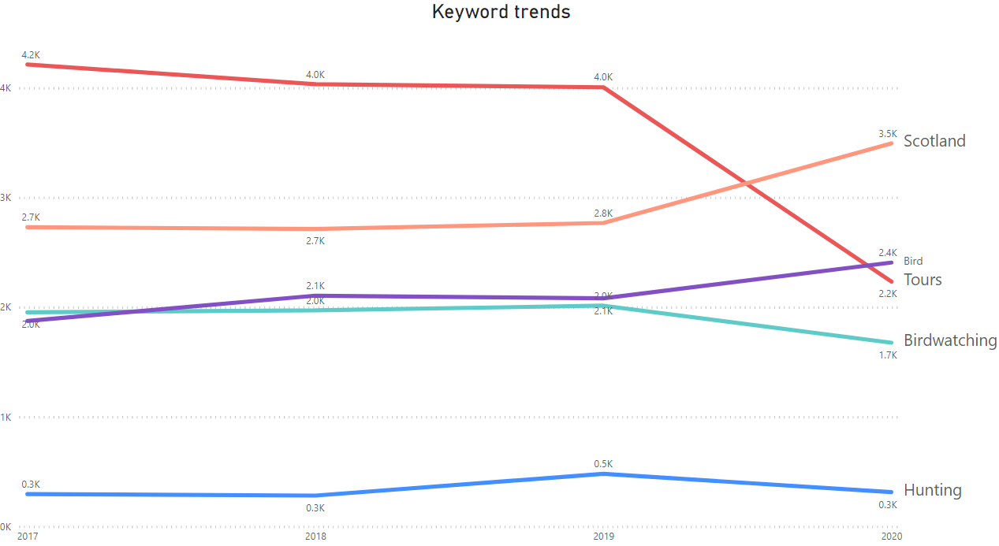
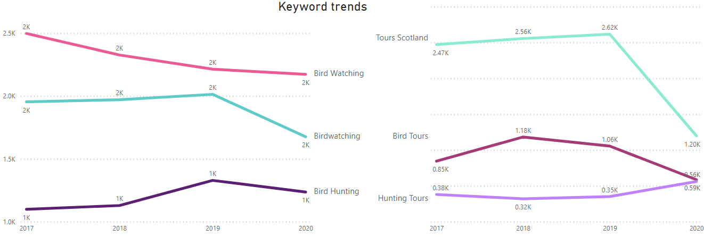
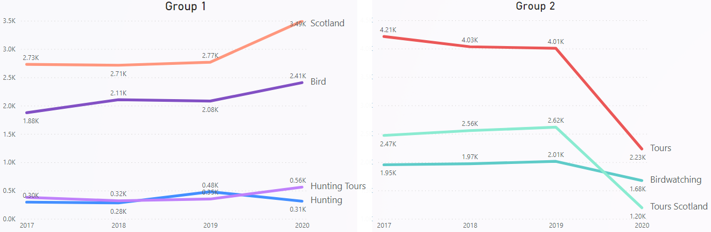
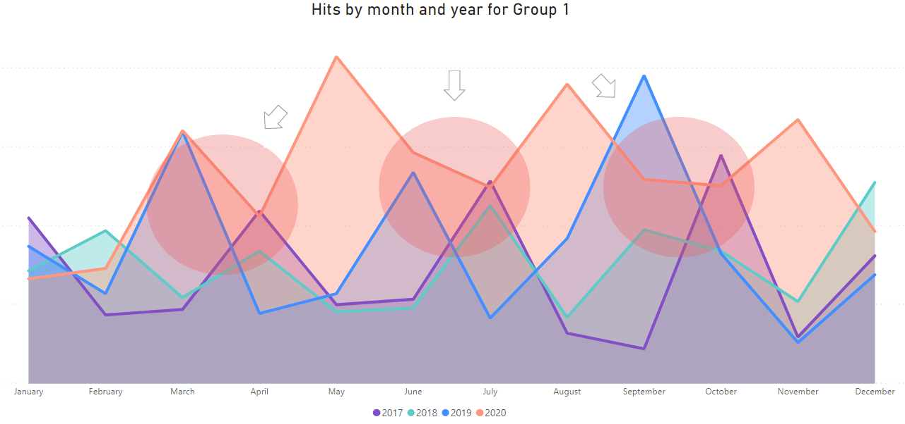

# Choosing a trendy brand name

### Case brief

> Five business partners experienced in travel and tourism, tour operations and hospitality have initiated a project aimed to establish a new tour operator based in Scotland offering guided birdwatching tours across Nature Reserves. The project aims to target the UK internal market.
Each of the partners argued about the brand name. The implications of this decision are significant. It has to provide a clear association with the activity of the tour operator for the marketing purpose. From product, social media to the whole identity and positioning on the market is directly linked to this name.

#### Understanding the problem
The product is planned to operate mostly online and the Search Engine Marketing is critical for the market fit. A data-driven approach is considered to provide some insight helping with this decision.

#### Focus
- Compile a list of recommended keywords and their combinations;
- Use the Google Trends data for the research (most recent 4 years, GB);
- Analyse the trend datasets and reveal the potential of the keywords.

### Data Preparation 

1. The list of recommended keywords saved in a .csv file [keywords](keywords.csv):
- Bird, Hunting, Birdwatching, Tours, Scotland, 
- Bird Hunting, Bird Watching, Hunting Tours, Tours Scotland, Bird Tours,
- Bird Tours Scotland, Birdwatching Tours Scotland, Hunting Tours Scotland, Bird Hunting Tours Scotland.

2. Collecting the Google Trends data for the last 4 years.
>To make it easier to collect and save the required data in a spreadsheet, an [R Google keywords script](Gtrends.r) is used.
    
a. Install packages

```R
install.packages("readr")
install.packages("gtrendsR")
install.packages("purrr")
install.packages("dplyr")
install.packages("readxl")
```

b. Load packages

```R
library(readr)
library(gtrendsR)
library(purrr)
library(dplyr)
library(readxl)
```

c. Extract the keywords from a .csv list

```R
kwlist <- readLines("keywords.csv")
```

d. View the list of keywords
```R
View(kwlist)
```

e. Function to set the geographic region, interested timeframe, search channel and return only the _interest_over_time_

```R
googleTrendsData <- function (keywords) { 
  country <- c('GB') 
  time <- ("2017-01-01 2021-01-01") 
  channel <- 'web' 
  
  trends <- gtrends(keywords, 
                   gprop = channel,
                   geo = country,
                   time = time ) 
  
  results <- trends$interest_over_time 
}
```

f. Check and return error message in console if encountered
```R
output <- data.frame()
```

g. Mapping and export the results as a [keywordsresults.csv](keywordsresults.csv) file
```R
for (i in c(1:length(kwlist))) {
  try({
    output_new = map_dfr(.x = kwlist[i],
                         .f = googleTrendsData) %>%
      data.frame()
    output <- rbind(output, output_new)
  })
  write.csv(output, 'keywordsresults.csv')
}
```
### Modelling
>The meaningful insights of the dataset are explored with  Power BI for easy creation and visualisation of analytics.

a. The first set of keywords to analyse: Scotland, Bird, Tours, Birdwatching, Hunting.



The analysis shows trends:
- Negative for Tours _(- 4.27% to 2018, - 0.69% to 2019 and - 44.26% to 2020)_
- Positive for Scotland _(+ 1.99% to 2019 and + 26.23 to 2020)_
- Negative for Birdwatching _(- 16.78% to 2020)_
- Positive for Bird _(+ 12.27% to 2018, - 1.14% to 2019 and + 15.67% to 2020)_
- Neutral for Hunting _(+ 70.21% to 2019 and - 34.79%  to 2020)_
  
b. The second set of paired keywords to analyse:
Bird Watching, Birdwatching, Bird Hunting and Tours Scotland, Bird Tours, Hunting Tours.


The analysis shows trends:
- Negative for Bird Watching _(- 6.85% to 2018, - 4.86% to 2019 and - 1.85% to 2020)_
- Negative for Birdwatching _(+ 2.18% to 2019 and -16.78% to 2020)_
- Positive for Bird Hunting _(+ 2.73% to 2018, 17.71% to 2019 and -7% to 2020)_
- Negative for Tours Scotland _(- 54.24% to 2020)_ 
- Negative for Bird Tours _(- 10.74% to 2019 and - 44.75% to 2020)_
- Positive for Hunting Tours _(+ 9.69% to 2019 and + 59.86% to 2020)_

c. The third set of paired keywords to analyse was split into 2 groups:
- Group 1: Bird Hunting Tours Scotland;
- Group 2: Birdwatching Tours Scotland.


- Group 1 has the most interesting trend, from 2017 rising on average by +33.9% to 2020.
- Group 2 is trending down by 2020, falling on average by - 38.4%.

d. The analysis of Group 1 by months and trends by years between 2017 and 2020.



- The time-series analysis shows seasonal patterns with increased frequency for the months: March-April, June-July, September-October that are meaningful for Search Engine Marketing.

### Recommendations

> Based on evidence from the Google Trends search index data and the steps of the data analytics process was revealed that
the brand name ***Bird Hunting Tours Scotland*** is more likely to align with the desired objective of the project.

>The specific searches for these keywords are in seasonal correlation and might lead to the acquisition of the right audience. The recommended months for Search Engine Marketing are March-April, June-July, September-October.