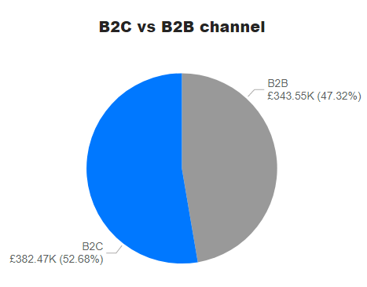
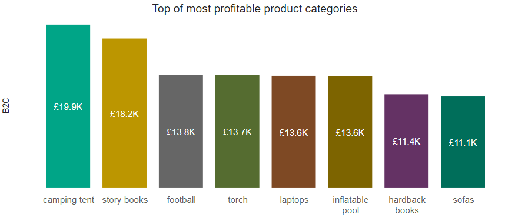

# Identifying the high potential channel to exploit <a href="https://powerbi.microsoft.com/en-us/"></a>

### Case brief
>Company X is an e-commerce platform that emerged as a real competitor for other online retailers. It offers B2B services for both large and small businesses and B2C services. On its growth path within the e-commerce industry, the company wish to capitalise on new opportunities for small businesses.

#### Focus
- Analyse the datasets containing competitors financial information to reveal the high potential channel to exploit for small businesses.

### Understanding the data

The information was collected by a research team, structured in tables and is ready for use after minimal transformations.
There are 2 datasets provided for the 10 largest competitors:
- daily sales data;
- monthly costs data.

### Define the solution 
- Profitability analysis by comparing the profit levels for B2B and B2C channels.
- Identify the product categories with the highest profit margins in the selected channel.

### Data Preparation
>Connect the data source to the Microsoft Power BI

1. Table "competitor_daily_sales"

- Changing the data type
```SQL
=Table.TransformColumnTypes(#"Promoted Headers",{{"Column1", Int64.Type}, {"company", type text}, {"date", type date}, {"location", type text}, {"market", type text}, {"channel", type text}, {"product_category", type text}, {"total_sale_amount", type number}})
```
- Changing the data type
```SQL
= Table.TransformColumns(#"Renamed Columns",{{"date", Date.Month, Int64.Type}})
```

2. Table "competitor_monthly_costs"

- Changing the data type
```SQL
= Table.TransformColumnTypes(#"Promoted Headers",{{"Column1", Int64.Type}, {"company", type text}, {"year", Int64.Type}, {"month", Int64.Type}, {"fixed_costs_for_b2b_sales", type number}, {"fixed_costs_for_b2c_sales", type number}, {"variable_costs_for_b2b_sales", type number}, {"variable_costs_for_b2c_sales", type number}})
```

3. Aggregation to sum total costs by channel B2B/B2C
```SQL
= SUM('competitor_monthly_costs'[fixed_costs_for_b2b_sales]) + SUM('competitor_monthly_costs'[variable_costs_for_b2b_sales])
```
```SQL
= SUM('competitor_monthly_costs'[fixed_costs_for_b2c_sales]) + SUM('competitor_monthly_costs [variable_costs_for_b2c_sales])
```

4. Aggregation to sum total sales by channel B2B/B2C
```SQL
= CALCULATE(SUM('competitor_daily_sales'[total_sale_amount]),
	'competitor_daily_sales'[channel] IN { "business-to-business" })
```
```SQL
= CALCULATE(SUM('competitor_daily_sales'[total_sale_amount]),
	'competitor_daily_sales'[channel] IN { "business-to-business" })
```

5. Calculate profits by channel B2B/B2C
```SQL
= [total_sale_amount for business-to-business] - [Total costs for b2b]
```
```SQL
= [total_sale_amount for business-to-consumer] - [Total costs for b2c]
```

### Modelling

- [ ] Profits by channels B2B/B2C
  
_Pie chart (Value - total profits b2b and b2c data)_


- [ ] Top of most profitable product categories in B2C channel
  
_Stacked column chart (Axis Y – product category data, Axis X – Sum of profits for b2c data)_


### Analysys and recomandations

>The data analysis of the largest competitors on figures recorded between April and July 2021 on small businesses market explored the higher potential for the ***B2C channel*** of products that is with 5.36% more than business to business channel. 

- The profit level of the B2C channel was at £382,471.56 for the period.

- The highest profit margins include 8 Product categories with a profit of over £10.000 leading with camping tents at £19,855.84.

#### Recommendations

The B2C channel has to be exploited to maximise profits:
- seasonal for sports products related to the outdoors such as camping tents, inflatables, torches or football accessories;
- on permanent basic for storybooks and hardback books.