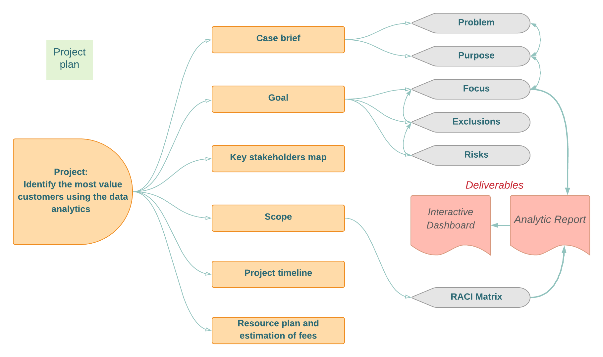
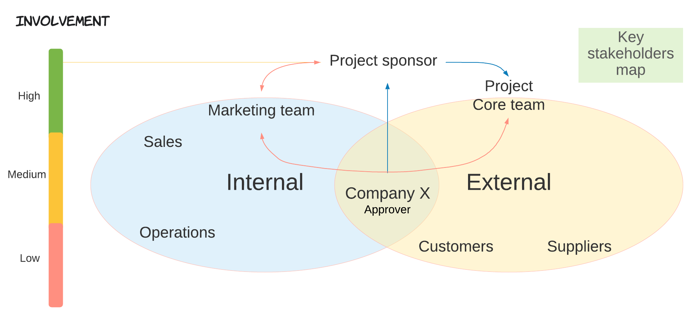
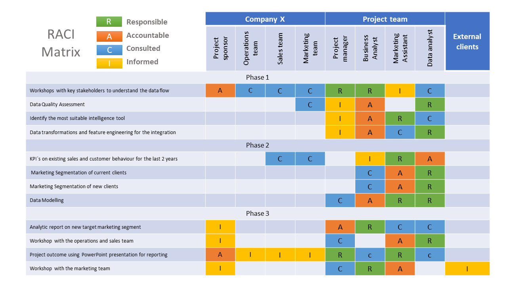
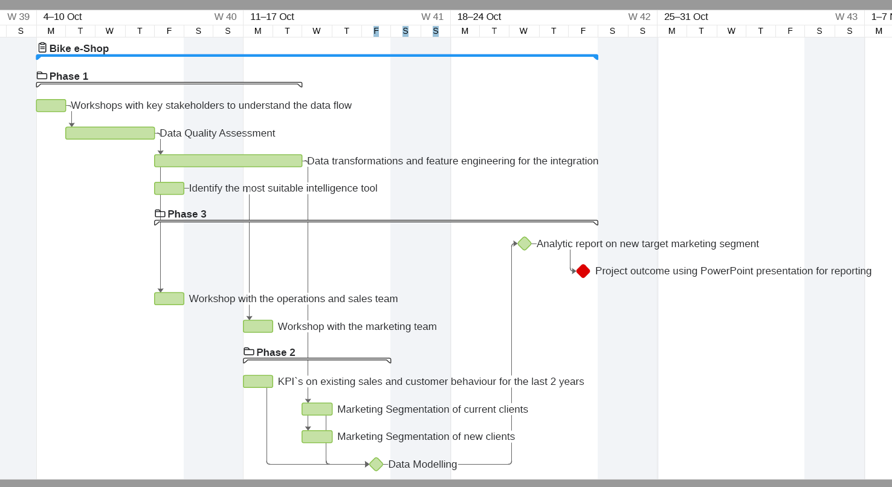
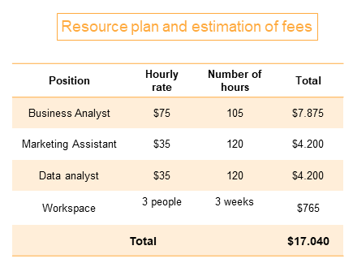

# Project: Identify the most value customers using the data analytics

### Case brief
>Company X specialises in high-quality bikes and accessible cycling accessories to riders. It has an expertise of 15 years on the market and owns several physical shops. It operates on the Wix platform for its web presence and transactions. The successful Bike e-Shop is using the targeting marketing strategy.

##### Problem
_Up to date, the marketing team made decisions based on the information available through the built-in analytical tool of the product they use. At one point they realised that some of the metrics are inaccurate and don't provide a real measurement. The decisions made on average data not always are effective. An example was provided the bounce rate metric that is not accurate on dynamic pages engineering._

##### Purpose
_Company X enquire to analyse their data and reveal useful customer insights that could help to optimise resource allocation and choose the right strategic approach by the marketing team. A ​more intelligent way to the insight of the current customers' intents to improve the performance and target high-value customers from a new dataset of potential customers._

#### Project plan

### Goal
>Delivering an interactive analytic report in 3 weeks after data processing that will reveal the potential from a list of 1000 new clients aiming to drive the most value for the organisation based on demographics and behaviour of current customers.

##### Focus
- Analyse the existing customer trends and behaviour using the collected 3 datasets: Customer demographic, customer address and transactions.
***Deliverable***: *Analytic Report.*
- Identify the most suitable intelligence tool for modelling data that the marketing team will use to make effective decisions and drive the value from a new list of 1000 potential customers which have no prior transaction history with the company.
***Deliverable***: *Interactive Dashboard.*

##### Exclusions
- Implementation forecast, guidance and costs.

##### Risks
- Lack of clarity in communication with key stakeholders.
- Reputational and business partners of the client.
- Methodology and Standards assumption.
- Data Quality presented for processing.

#### Key stakeholders map

### Scope

| Phase 1 | Phase 2 | Phase 3 |
| ------- | ------- | ------- |
| _Data Exploration_ | _Model Development_ | _Interpretation_ |
|  Workshops with key stakeholders to understand the data flow | KPI`s on existing sales and customer behaviour for the last 2 years |  Compilation of the interactive analytic report on new target marketing segment enhanced with a benefit assessment |
|Data Quality Assessment | Marketing Segmentation based on current demographic data of clients | Workshop with the operations and sales team: _Importance of the accuracy in data input_ | 
Identify the most suitable intelligence tool for the marketing team (Microsoft Power BI or Tableau) | Marketing Segmentation based on demographics of new list of clients | Compilation of the outcome using PowerPoint presentation for reporting | 
 | Data transformations and feature engineering for the integration | Data Modelling to identify the most valuable market segment of new customers | Workshop with the marketing team: _Using the analytics dashboard_ |

#### RACI Matrix

### Project timeline _(Gantt chart)_

### Resource plan and estimation of fees

