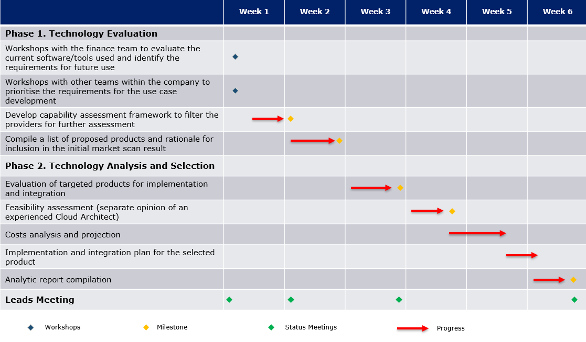
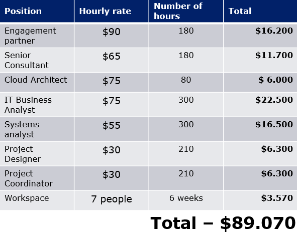

# Project charter Market Scan 

### Case brief
>Company X asked for consultancy in their market scan to establish and selection for a new financial accounting management solution. 
It plans to open a manufacturing site and expand its network and for a long term vision, the aim is to ensure an efficient, smooth, high-quality approach to its resources.

### Focus
Assessment of the financial accounting system market landscape and evaluate the following attributes:
- adaptable to the business requirements for reconciliations and consolidation;
- flexible to the potential growth of the end-user database over the next years, mostly Australian market;
- agile to operate with financial information from multiple sources and integrate multiple reporting tools used by other systems, preferable Salesforce.

#### Exclusions 
- Zonal regulatory assessment of the solutions.

#### Risks, issues and dependencies
- Lack of clarity in communication with key stakeholders.
- Reputational and business partners of the client.
- Methodology and Standards assumption.
- Budget creep.

### Scope

| _Phase 1. Technology Evaluation_ | _Phase 2. Technology Analysis and Selection_ |
| ---- | ----- |
| Compile a list of proposed providers and rationale for inclusion in initial market scan result; | Evaluation of targeted providers for implementation and integration; |
Develop a framework for capability assessment to filter the providers for further assessment;| Compile an analytic report; |
| | Implementation and integration plan. |

### Deliverables
- Delivering an analytic report after 6 weeks of the market evaluation that will highlight optimal technological solutions for a new financial accounting management system.

[Market Scan Analytic Report](https://github.com/VladRomanciuc/Personal/blob/6a6ffa80b1f059deb941108bb42e856581bf7723/Business%20Analytics/Market%20Scan%20Report/README.md)

### Milestones

| | | |
| --- | --- | --- |
| :small_orange_diamond: | Capability assessment framework: |  Week 2 |
| :small_orange_diamond: | Initial market scan result: | Week 2 |
| :small_orange_diamond: | Evaluation of products: | Week 3 |
| :small_orange_diamond: | Feasibility assessment: | Week 4 |
| :small_orange_diamond: | Analytic report: | Week 6 |

### Initial project timeline
- [ ] Duration - 6 weeks.

### Project team estimation and fees

